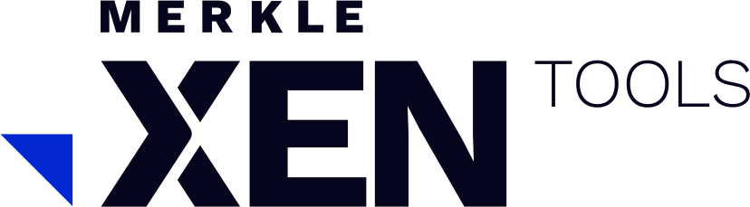

# Merkle XEN — links page

A single-page links hub, in the style of Linktree. One column of links,
nothing else. Plain HTML/CSS/JS — no build step, no dependencies.

```
index.html          the page (and the logo lockup)
assets/links.js     ← the only file you edit to add links
assets/styles.css   look and feel
assets/app.js       renders the page from links.js
```

## Adding a link

Open `assets/links.js` and add a block to the `LINKS` list:

```js
{
  title: "What it is",
  description: "One short line",   // optional
  url: "https://…",
  tag: "Toolkit",                  // optional pill on the right
  accent: "cobalt",                // cobalt | purple | blue | red | grey
  badge: "New",                    // optional sticker — use sparingly
},
```

`accent` sets the colour the row flips to on hover. Order in the list is the
order on the page. Save, refresh, done.

## Changing the wording

The `PROFILE` object at the top of `assets/links.js` holds the headline,
tagline, footer copy, email and social links. A `\n` in `headline` forces a
line break on wide screens; narrow screens ignore it and wrap on their own.

## The logo

The lockup in `index.html` is a **stand-in**, drawn to match the brand — the
`MERKLE` line is set in Work Sans and `XEN` is drawn as geometric paths, with
the cobalt wedge. To use the official artwork, replace everything between the
`<a class="bar__logo">` tags with your SVG, or point it at a file:

```html
<a class="bar__logo" href="./"></a>
```

It's the master `MERKLE XEN` lockup rather than `MERKLE XEN TOOLS`, since XEN
Tools is one of the things listed on the page rather than the page itself.

## Running it

Open `index.html` in a browser, or serve the folder:

```bash
python3 -m http.server 8000
```

## Publishing

Any static host works. For GitHub Pages: **Settings → Pages → Deploy from a
branch**, pick the branch and the `/ (root)` folder.

Work Sans loads from Google Fonts, with a system sans fallback if it's blocked.

## A note on design

Flat colour blocking, cobalt and ink, Work Sans — the palette and type come
from the XEN brand so the page sits next to the rest of it. It deliberately
does **not** follow the print design system
(`XEN-LAB-Event-Print-Design-System.md`); that governs posters and collateral,
not this page.
